# 实验1 Oracle数据库软件获取及其安装教程

## 1. 所需文件

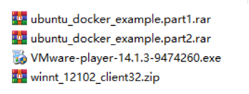

前两个压缩包为虚拟机的磁盘文件，分卷压缩成两个文件方便将其存储在U盘中。第三个为VMware Player的安装文件，第四个是Oracle数据库的客户端安装包。

## 2. 配置虚拟机
首先安装VMware Player。双击安装包，将其安装到合适的目录即可。

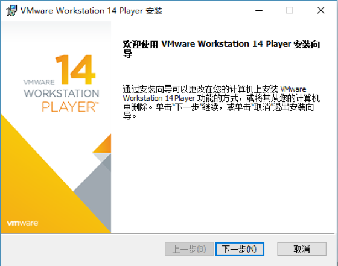

如果之前有安装VMware Player或者是VMware Workstation等软件可以跳过此步。将虚拟机磁盘文件解压到硬盘上，分卷压缩的文件需要防止在同一个目录下，解压任意一个文件一次即可。解压后得到一个占用17.6G空间的文件夹，内部是虚拟机的磁盘文件。

如果计算机配置了固态硬盘，在使用时虚拟机时建议将上述解压出的文件夹拷贝到固态硬盘的分区下，可以在运行时大大加快速度。在不用时可以将其存储在机械硬盘以节省空间。

启动VMware Player，在主页中点击打开虚拟机。

引导至刚刚解压的目录，选中目录中后缀为vmx的文件。

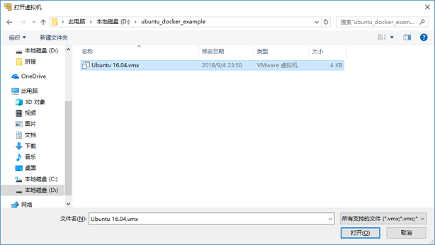

点击打开后即可在VMware中看到该虚拟机。点击编辑虚拟机设置按钮可以对该虚拟机的资源进行设置。

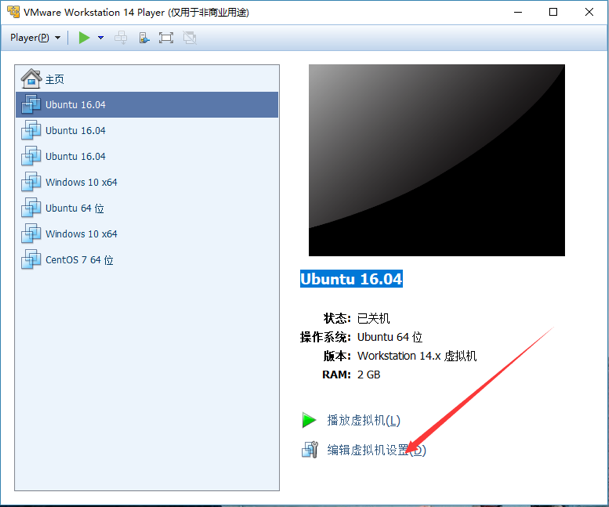

本虚拟机默认使用2个CPU核心，2GB内存。如果计算机使用了核心更多的CPU或者更大的内存，则可以在虚拟机设置中进行调整，增大分配给虚拟机的CPU或者内存资源以增加虚拟机的运行速度。

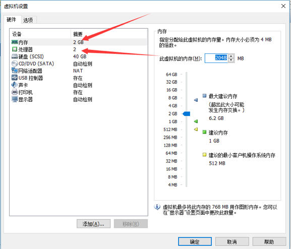

设置完毕后点击播放虚拟机即可运行该虚拟机。如果在启动虚拟机时显示下列画面，则表示计算机BIOS中intel CPU的虚拟化未启用，则需要进入BIOS将Intel VT-x启用。具体方法见第9节。

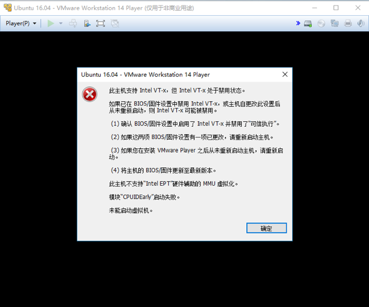

出现下列画面则表示运行正常，选择我已复制该虚拟机，等待片刻虚拟机即启动。此时如果鼠标点击了虚拟机内部可能会导致鼠标指针锁定在虚拟机内部，此时仅需要按下Ctrl+Alt键即可解锁。

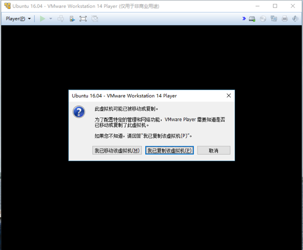

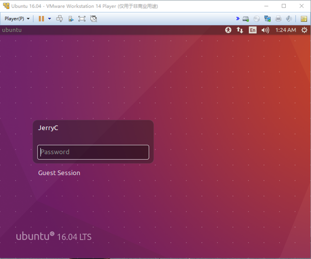

在图形界面登陆用户，此处密码为1234。登陆系统后可能会提示系统错误，点击Cancel忽略即可。

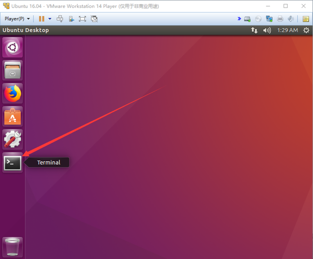

进入桌面后启动终端，在终端输入 ifconfig命令，敲击回车。

此时记录下 ens33网卡中的ip地址，每台虚拟机的ip地址都不一样。

虚拟机外部可以通过这个ip地址访问虚拟机。

## 3. 安装Oracle客户端

解压winnt_12102_client32.zip，在解压后的文件夹中找到setup.exe安装Oracle数据库的客户端。

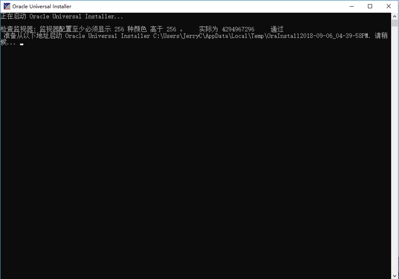

等待片刻进入到安装类型的页面，选择“运行时”，点击下一步。

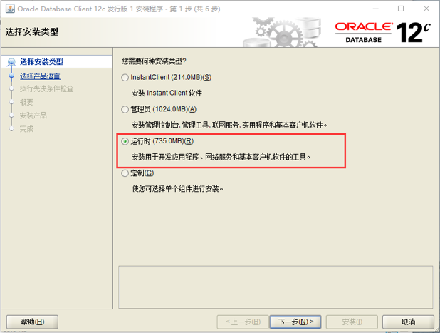

接下来都按默认选择安装即可，如有需要可以调整软件的安装位置。等待安装程序检查完系统环境后点击安装。

安装完成后即可看到开始目录中有这些图标。

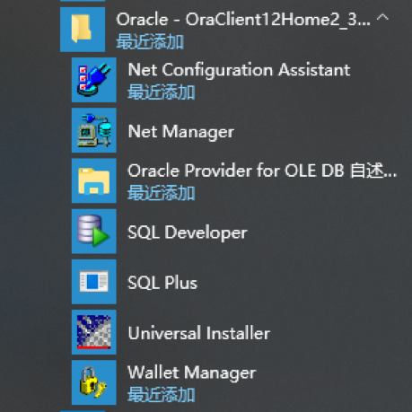

## 4. 使用SQL Developer连接数据库

点击图标运行SQL Developer。点击左上角的＋按钮，新建一个数据库连接。

需要设置的参数如下，用户名为system，口令为oracle，主机名为刚刚记录下的ip地址，端口为默认的1521，SID为xe。

点击测试，如设置无误，在左下角会显示一个 状态：成功 的状态。

选择连接即可创建一个新的连接。

## 5. 使用SQL Plus连接数据库

在搜索栏搜索cmd，运行Windows命令提示符（Windows 10也可以使用PowerShell）

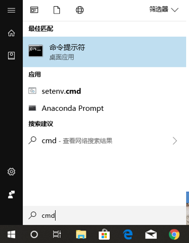

输入命令：`sqlplus system/oracle@//192.168.119.134:1521/xe`

其中，ip地址需要替换为之前记录下的ip地址。上述命令与SQL Developer中设置的参数一一对应。

敲击回车即可连接数据库。

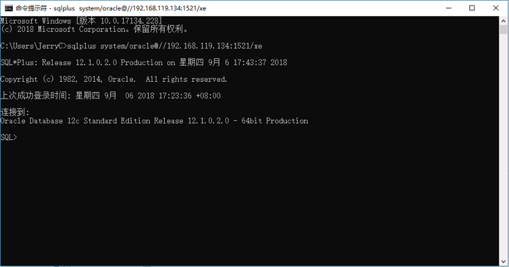

## 6. 配置Oracle EM控制台
Oracle Enterprice Manager Console 是Oracle提供的基于网页的数据库管理工具，在虚拟机中的数据库并没有将此服务映射出来，因此需要修改相应配置。使用管理员sys或者system登陆数据库（SQLPlus、SQLDeveloper、Navicat都可以），新建查询运行下列语句：
`exec dbms_xdb_config.sethttpport(8080);`
运行后如下，即将OEM的端口映射到8080端口，然后可以在浏览器中打开OEM控制台。

OEM的网页链接为 `http://虚拟机的ip地址:8080/em`，在浏览器中输入上述url，即可进入OEM界面，输入用户名和密码即可登陆。

登陆后主界面如下：

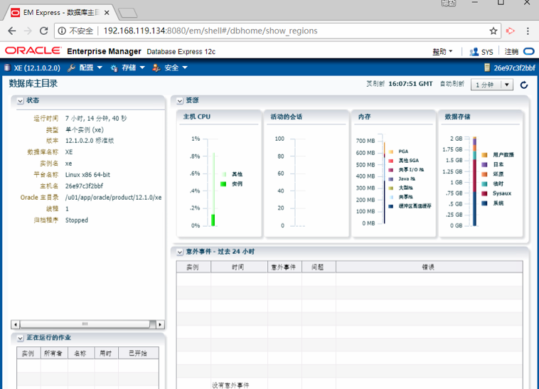

## 7. 更多连接数据库的用户名
虚拟机中的有许多默认的用户名以及数据库可以供我们连接，可以参考下表：

|用户名|口令|SID|
|--|--|--|
|sys|oracle|xe|
|system|oracle|xe|
mdsys|oracle|xe|
|hr|oracle|xe|

使用最后一个hr用户登录可以访问实例数据。下图为使用hr用户登录数据库后执行查询语句。

## 8. 虚拟机的关机

如果虚拟机处于锁定状态，则需要输入密码登陆桌面。点击左上角的关闭按钮即可以关闭打开的窗口，点击右上角的按钮，选择Shut Down按钮。

点击Shut Down按钮关机即可。稍等几分钟窗口消失后即安全关闭了虚拟机。

## 9. 在BOIS中开启Intel VT-x

启动虚拟机时显示Intel VT-x禁用的错误需要进入BIOS将其启用。首先重启计算机，在开机过程中按住F2按钮进入BIOS设置界面。各个型号的电脑进入BIOS界面的方法不尽相同，大部分电脑都是按住F2键，Thinkpad系列开机按住F1或者F12，惠普笔记本按住F9。如果都失败，可以上百度搜索具体型号进入BIOS的方法或者询问售后。

进入BOIS界面类似上图，可以使用键盘的上下左右回车以及esc键进入各级目录。大部分的BIOS都是这种布局，Intel虚拟化开关通常在高级（Advanced）或者安全（Security）选项下，每台电脑可能都不一样。此时需要在BIOS的目录中找到Intel Virtualization Technology选项。

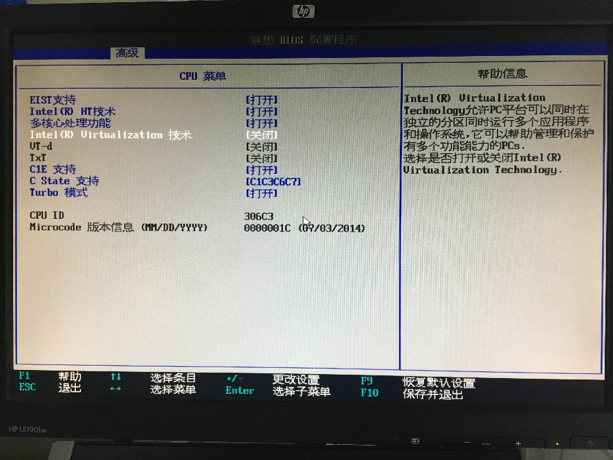

将其修改为打开（Enable）。

按F10保存并退出，等待电脑重启后便可正常运行虚拟机。如果未能在上述界面中找到Intel Virtualization Technology选项，建议上百度搜索电脑的具体型号或者咨询售后。

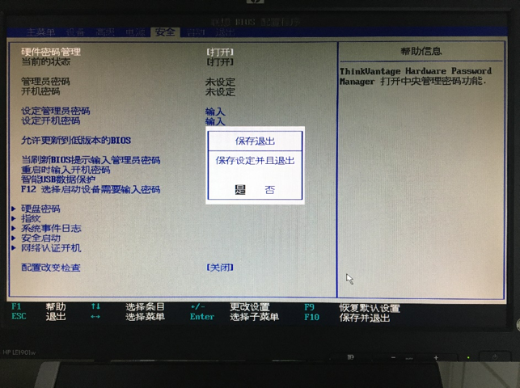

